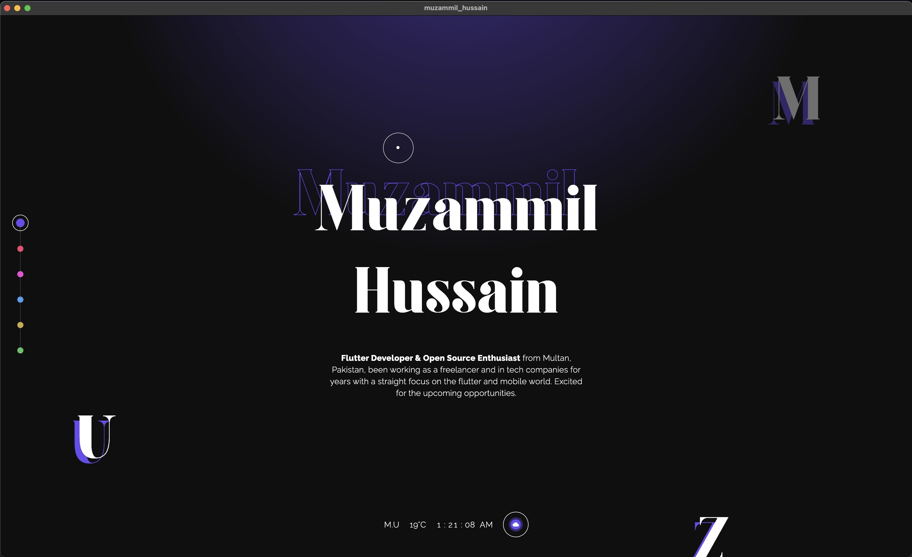

# Personal Portfolio

My Personal Portfolio website crafted with Flutter 💜

## 📑 Overview

This is my personal portfolio website v0.01 (Still a work in progress) built with Flutter - available for multiple platforms : website , android, ios and windows

### 🗝️ Key Features:

- Fully Responsive 🤌🏻
- Dynamic Themes 🥂
- Beautiful Animations 🎠
- Recent Works Section (With support for play store and github links) 🤙🏻

### 🔗 Preview Links:

- 🕸️ [Web Version: https://muzammil-hussain.vercel.app/](https://muzammil-hussain.vercel.app/)

### 🪪 Project License:

This project is licensed under [BSD 3-Clause License](LICENSE).

Feel free to check it out and give it a ⭐ if you like it.
Follow me for more updates and more projects ...

Copyright (©️) 2023 **Muzammil Hussain**
